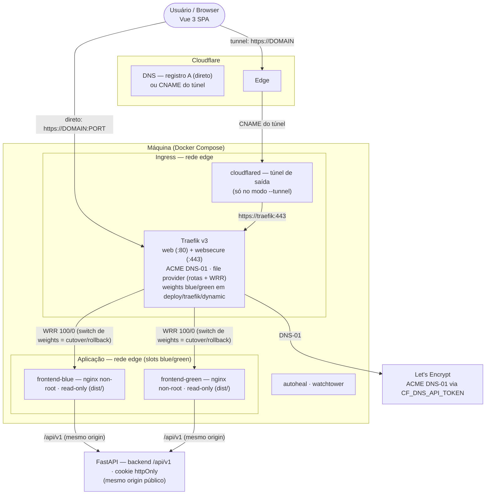
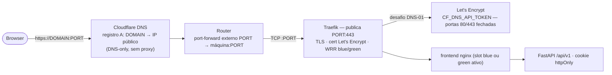
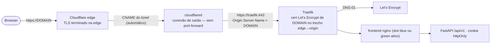
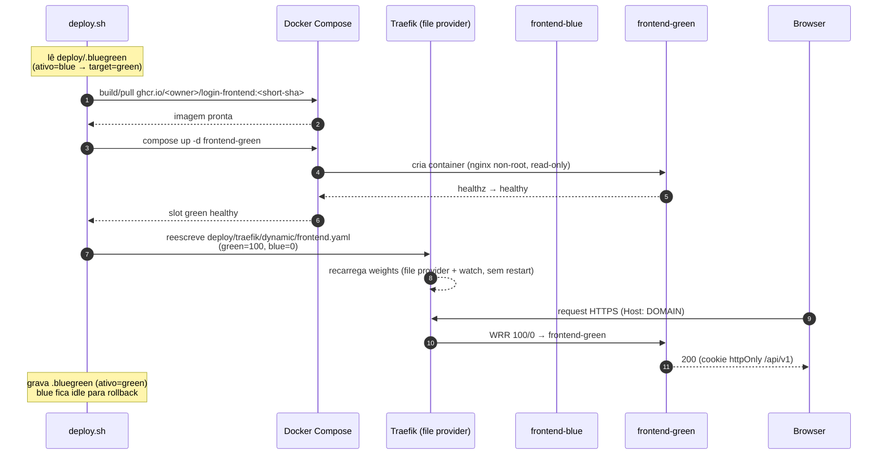
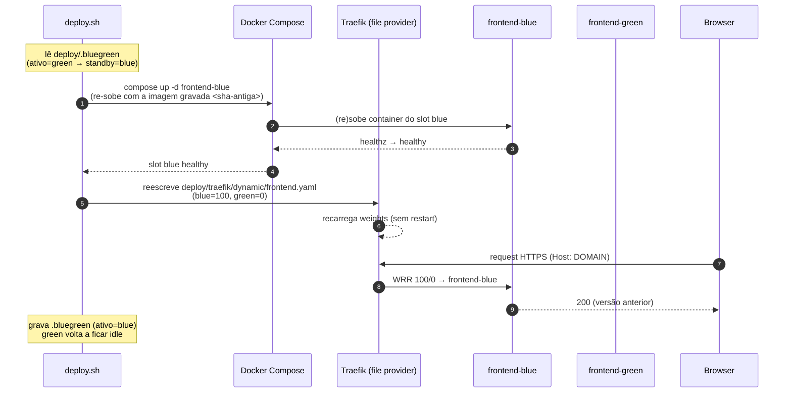

# login-frontend

Frontend de autenticação em Vue 3 + Vite + TypeScript (Pinia, vue-router, Vitest, Playwright).

Autenticação por **cookie httpOnly** (SameSite=Lax) definido pelo backend — nenhum token exposto ao JavaScript (proteção contra XSS).

## Tópicos

- [Stack](#stack)
- [Arquitetura](#arquitetura)
  - [Visão geral do sistema](#visão-geral-do-sistema)
  - [Modo direto (port-forward)](#modo-direto-port-forward)
  - [Modo tunnel (Cloudflare Tunnel)](#modo-tunnel-cloudflare-tunnel)
- [Configuração](#configuração)
- [Contrato de API](#contrato-de-api)
  - [Autenticação (cookie httpOnly)](#autenticação-cookie-httponly)
  - [Endpoints](#endpoints)
  - [Erros](#erros)
  - [Anti double-submit](#anti-double-submit)
- [Scripts](#scripts)
- [Deploy (Docker / HTTPS)](#deploy-docker--https)
  - [Arquitetura do blue-green](#arquitetura-do-blue-green)
  - [Configuração (.env)](#configuração-env)
  - [Uso](#uso)
  - [Blue-green em detalhe](#blue-green-em-detalhe)
  - [Exposição direta (port-forward)](#exposição-direta-port-forward)
  - [Cloudflare Tunnel](#cloudflare-tunnel)

## Stack

- Vue 3 (`<script setup>`) + TypeScript
- Vite + vue-tsc
- Pinia (estado de sessão) + vue-router (rotas protegidas)
- Vitest (unit) + Playwright (e2e)
- oxlint / ESLint / oxfmt

## Arquitetura

### Visão geral do sistema

A aplicação é um SPA Vue 3 servido por nginx (container não-root, read-only) em **dois slots blue/green**, atrás do **traefik** (TLS + ACME DNS-01 via Cloudflare, com switch de tráfego por weights sem downtime). O frontend e o backend **FastAPI** compartilham o mesmo origin público (`/api/v1`), então o cookie httpOnly flui sem CORS. A máquina tem duas maneiras de expor o serviço: **modo direto** (port-forward no roteador) ou **Cloudflare Tunnel** (conexão de saída do `cloudflared`, sem abrir portas).



### Modo direto (port-forward)

O traefik publica a porta `PORT` do host; o registro **A** do `DOMAIN` aponta para o IP público e o roteador faz port-forward. O certificado é obtido por **DNS-01** — as portas 80/443 não precisam estar abertas na internet.



### Modo tunnel (Cloudflare Tunnel)

O `cloudflared` abre uma conexão de saída para a edge da Cloudflare — nenhuma porta precisa ser aberta. O TLS do browser termina na edge; o cert Let's Encrypt de `DOMAIN` continua valendo no trecho edge→origin.



Os detalhes de deploy dos dois modos estão em [Deploy (Docker / HTTPS)](#deploy-docker--https).

## Configuração

```sh
bun install
bun dev            # Vite, proxy /api → http://localhost:8000
bun run build
bun test:unit
bun run lint
```

`VITE_API_BASE_URL` (`.env`) define a base da API; padrão `/api/v1`. Em dev, o proxy do Vite redireciona `/api` para `http://localhost:8000`.

## Contrato de API

Base: `/api/v1`. Todas as chamadas usam `credentials: 'include'` (cookie enviado automaticamente) e enviam corpo JSON com `Content-Type: application/json` quando aplicável.

### Autenticação (cookie httpOnly)

| Cenário | Comportamento |
| --- | --- |
| Login bem-sucedido | Backend define cookie httpOnly (SameSite=Lax) via `Set-Cookie` e responde `200 {"user": {...}, "expires_at": "<ISO UTC>"}` |
| Sessão válida | `GET /me` → `200 {"user": {...}, "expires_at": "<ISO UTC>"}` |
| Sessão inválida/expirada | `GET /me` → `401 {"detail": "..."}` |
| 401 em rota autenticada | Frontend dispara `auth:unauthorized`, limpa a sessão e redireciona para `/login` |
| Token expira no tempo (`expires_at`) | Frontend desloga localmente via timer (e `visibilitychange`); `expires_at` ausente → depende do `/me` no boot |

`expires_at` (ISO 8601 UTC, derivado do claim `exp` do JWT) é **opcional** no frontend: se ausente, a sessão segue dependendo do `/me`. O valor é perseguido em `localStorage` (`auth_expires_at`) e re-sincronizado a cada `/me` bem-sucedido. A autoridade final continua sendo o 401 do backend.

O cookie é httpOnly, então **o nome dele é irrelevante para o frontend** — o JS nunca o lê. No backend, `/me` e demais rotas autenticadas devem ler o mesmo cookie que `/login` define.

### Endpoints

| Método | Rota | Autenticado | Corpo | Respostas |
| --- | --- | --- | --- | --- |
| POST | `/register` | não | `{username, email, password}` | 201 · 409 (já existe) · 422 (validação) |
| GET | `/verify_email` | não | `?token=` | 200 · 410 (expirado/inválido) |
| POST | `/login` | não | `{username, password}` | 200 `{"user": {"username", "email"}, "expires_at"}` + cookie · 401 |
| POST | `/logout` | sim | — | 204 (limpa o cookie) · 401 |
| PATCH | `/change_password` | sim | `{current_password, new_password}` | 204 · 400/401 · 422 |
| DELETE | `/delete_account` | sim | — | 204 · 401 |
| POST | `/forgot_password` | não | `{email}` | 204 (sempre genérico, evita enumeração) |
| PATCH | `/reset_password` | não | `{token, new_password}` | 204 · 400 (token inválido/expirado) · 422 |
| GET | `/me` | sim | — | 200 `{"user": {"username", "email"}, "expires_at"}` · 401 |
| GET | `/health` | não | — | 200 |

### Erros

Todos os erros são JSON `{"detail": "..."}`. O frontend usa `detail` como mensagem de erro (`HttpError.message`), caindo para `Erro <status>` quando ausente. Estados relevantes: `400`, `401`, `403`, `409`, `410`, `422`, `429`, `503`.

Timeouts: 15s por requisição; falha de rede vira `HttpError(0, "Falha de conexão com o servidor")`.

### Anti double-submit

Cada ação do store (`login`, `register`, `forgotPassword`, `logout`, `validateSession`) retorna `false` imediatamente se já estiver em loading; `BaseButton` desabilita e mostra spinner enquanto a requisição roda.

## Scripts

| Script | Descrição |
| --- | --- |
| `bun dev` | Servidor de desenvolvimento (proxy `/api` → `:8000`) |
| `bun run build` | type-check + build de produção para `dist/` |
| `bun test:unit` | Testes unitários (Vitest) |
| `bun test:e2e` | Testes e2e (Playwright) |
| `bun run lint` | oxlint + eslint |
| `bun run format` | oxfmt sobre `src/` |

## Deploy (Docker / HTTPS)

Stack no Docker Compose: **traefik** (HTTPS + ACME) → **frontend** (nginx não-root, read-only, **slots blue/green**) + autoheal + watchtower.

O deploy é **blue-green**: o frontend roda em 2 slots (`frontend-blue` e `frontend-green`), e o traefik decide quem recebe o tráfego por **weights** (100/0) num arquivo de config dinâmica. Atualizar a versão = subir o novo build no slot **inativo**, trocar os weights (recarga automática do traefik, zero downtime) e manter o slot antigo **idle** para rollback instantâneo.

### Arquitetura do blue-green

- **`deploy/compose/base.yaml`** — infra: traefik, autoheal, watchtower (+ networks/volumes).
- **`deploy/compose/frontend.yaml`** — slots `frontend-blue`/`frontend-green` (1 réplica cada; imagem vem de `FRONTEND_IMAGE`, tag única por deploy).
- **`deploy/compose/cloudflared.yaml`** — Cloudflare Tunnel (flag `--tunnel`).
- **`deploy/traefik/traefik.yaml`** — config estática do traefik (template; renderizada por `envsubst` → `traefik.generated.yaml`, gitignored).
- **`deploy/traefik/dynamic/frontend.yaml`** — routers + middlewares + **service weighted (WRR)** do traefik. Os **weights são a fonte de verdade do cutover/rollback**; o arquivo é regenerado pelo `deploy.sh` e recarregado automaticamente (file provider + `watch`).
- **`deploy/.bluegreen`** — estado dos slots (ativo + tag de imagem registrada de cada slot); gitignored.
- **`deploy/scripts/deploy.sh`** — orquestrador; `deploy/scripts/deploy.cloudflared.sh` — atalho `--tunnel`.
- **`deploy.sh` / `deploy.cloudflared.sh`** (raiz) — wrappers finos para os scripts.

Fluxo do `deploy`:

1. Lê o slot ativo em `deploy/.bluegreen` → **target = slot inativo**.
2. Constrói (ou puxa, com `--no-build`) a imagem `ghcr.io/<owner>/login-frontend:<short-sha>`.
3. Sobe a infra e o slot target; aguarda healthcheck (`/healthz`) ficar `healthy`.
4. **Switch**: reescreve `deploy/traefik/dynamic/frontend.yaml` com `target=100`, `outro=0` — o traefik recarrega sozinho (sem restart), cutover atômico.
5. Verifica `healthz` via traefik (HTTP 200) e grava o novo estado.
6. O slot antigo fica **idle** para rollback instantâneo; `prune` remove quando quiser.

#### Diagrama do deploy



#### Diagrama do rollback



### Configuração (.env)

`deploy.sh` cria `.env` a partir de `example.env` se não existir. Variáveis:

| Variável | Padrão | Descrição |
| --- | --- | --- |
| `DOMAIN` | `localhost` | Domínio público servido pelo traefik |
| `PORT` | `80` | Porta pública do traefik (ex.: `30033`) |
| `ACME_EMAIL` | `admin@exemplo.com` | E-mail do certificado Let's Encrypt |
| `ACME_CA_SERVER` | staging | URL ACME; produção usa `https://acme-v02.api.letsencrypt.org/directory` |
| `CF_DNS_API_TOKEN` | — | Token Cloudflare (Zone.DNS:Edit) para o desafio DNS-01 |
| `CF_TUNNEL_TOKEN` | — | Token do Cloudflare Tunnel (modo `--tunnel`) |
| `VITE_API_BASE_URL` | `/api/v1` | Base da API embutida no build do frontend |
| `DOCKER_IMAGE_OWNER` | `ofcoliva` | Owner da imagem no GHCR |

### Uso

```sh
./deploy.sh                    # deploy blue/green com build local
./deploy.sh --no-build         # usa a imagem já publicada (tag <short-sha> no GHCR)
./deploy.sh --tunnel           # + Cloudflare Tunnel (requer CF_TUNNEL_TOKEN)
./deploy.cloudflared.sh        # atalho para --tunnel
./deploy.sh status             # slots, imagens, health e weights atuais
./deploy.sh rollback           # volta o tráfego para o slot anterior (versão anterior)
./deploy.sh switch blue        # troca os weights manualmente para um slot
./deploy.sh prune green        # remove o container do slot inativo
./deploy.sh down               # derruba todo o stack
```

### Blue-green em detalhe

- **`deploy.sh deploy`**: primeiro deploy sobe o slot `blue`; deploys seguintes alternam `blue`→`green`→`blue`… O slot que recebia o tráfego antes fica **idle** (container parado, imagem preservada).
- **`deploy.sh rollback`**: re-sobe o slot standby usando a **tag de imagem registrada** em `deploy/.bluegreen` e inverte os weights — rollback da versão anterior sem rebuild.
- **`deploy.sh switch <blue|green>`**: cutover manual (ex.: canary — basta editar os weights para ex.: 95/5 no próprio `frontend.yaml` dinâmico).
- **`deploy.sh prune <blue|green>`**: remove o container do slot **inativo**. A tag de imagem continua registrada, então `rollback` ainda consegue redeploy dela. Não pode podar o slot ativo.
- **`deploy.sh down`**: `docker compose down` em tudo (o volume `traefik-acme` com o `acme.json` é preservado).
- **Watchtower** fica **desabilitado nos slots** (`com.centurylinklabs.watchtower.enable: "false"`): a atualização do frontend passa a ser exclusiva do `deploy.sh`. O watchtower continua atualizando traefik/autoheal etc.

A tag da imagem é o **short SHA do git** (`git rev-parse --short HEAD`); o CI também publica a tag imutável `<sha>` no GHCR além de `dev`/`main`/`latest`. Isso garante que a imagem da versão anterior continue disponível para `rollback`/`--no-build`.

O traefik usa **config estática renderizada por `envsubst`** (`traefik.generated.yaml`): quando um arquivo estático existe, flags/env do CLI são ignoradas, e env vars não são interpoladas dentro do YAML. O certificado é obtido por **DNS-01 via Cloudflare** e persistido no volume `traefik-acme` (`acme.json`). Mudanças na config estática (ex.: `ACME_EMAIL`) são detectadas pelo `deploy.sh`, que reinicia o traefik para aplicá-las; as rotas dinâmicas (weights) nunca exigem restart.

Existem **dois modos de exposição pública** (diagramas na seção [Arquitetura](#arquitetura)):

- **Modo direto** (`./deploy.sh`): o traefik publica a porta `PORT` do host e o registro A do `DOMAIN` aponta para o IP público da máquina, com port-forward no roteador.
- **Modo tunnel** (`./deploy.cloudflared.sh`): o `cloudflared` abre um túnel de saída para a edge da Cloudflare — nenhuma porta precisa ser aberta (ideal para IP dinâmico, CGNAT ou firewall que bloqueia portas).

### Exposição direta (port-forward)

1. No DNS do domínio, crie um registro **A** de `DOMAIN` apontando para o IP público da máquina (modo DNS-only/cinza, sem proxy da Cloudflare).
2. No roteador, faça **port-forward** TCP da porta `PORT` externa → `PORT` interna na máquina.
3. No `.env`, defina `PORT` (ex.: `30033`), `DOMAIN` e `ACME_CA_SERVER` de produção.
4. Rode `./deploy.sh` e acesse `https://DOMAIN:PORT`.

O desafio ACME usa **DNS-01** via API da Cloudflare (`CF_DNS_API_TOKEN`), então não é preciso liberar as portas 80/443 na internet.

### Cloudflare Tunnel

O container `cloudflared` conecta-se ao traefik via `https://traefik:443`. O TLS do browser é terminado na edge do Cloudflare; o cert Let's Encrypt continua valendo no trecho edge→origin.

1. Cloudflare Zero Trust → Networks → Tunnels → crie um túnel e copie o token
2. Preencha `CF_TUNNEL_TOKEN` no `.env`
3. Adicione o Public Hostname `DOMAIN` → Service `https://traefik:443`
4. No Public Hostname, em **Additional application settings → TLS**, defina **Origin Server Name** = `DOMAIN` (ou ative **Match SNI to Host**)
5. Rode `./deploy.cloudflared.sh`

Sem o `Origin Server Name` o cloudflared verifica o certificado do origin contra o nome do serviço (`traefik`); o traefik, para esse SNI, responde com o certificado padrão auto-gerado e o túnel falha com `tls: failed to verify certificate ... not traefik`. Com o ajuste, o traefik serve o cert Let's Encrypt de `DOMAIN`. (Alternativa: **No TLS Verify** = on, mas aí o trecho edge→origin deixa de validar o certificado.)

Nesse modo o registro A antigo do domínio é substituído pelo CNAME do túnel (gerado automaticamente) e o port-forward no roteador deixa de ser necessário. Os dois modos podem conviver — o modo direto continua acessível pela porta `PORT` mesmo com o túnel ativo.
