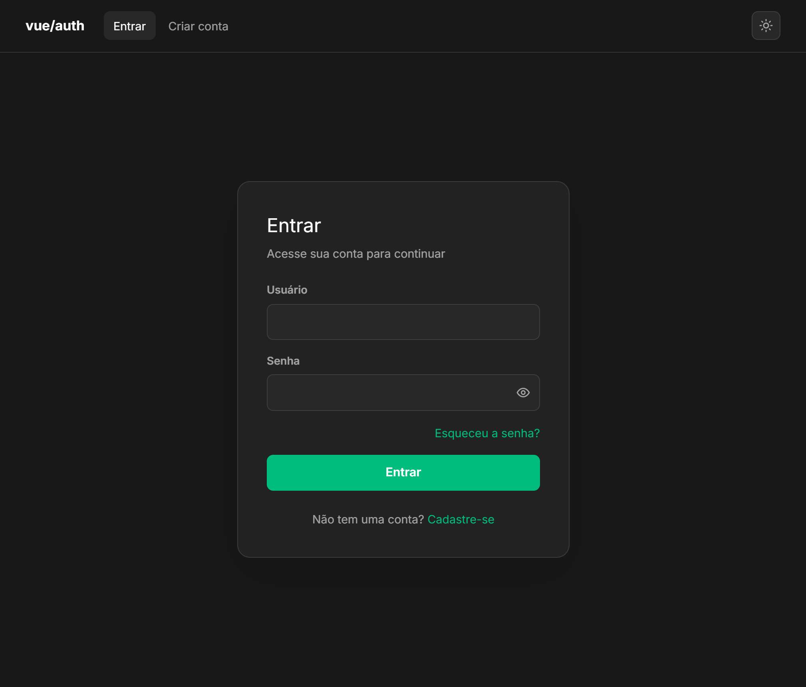
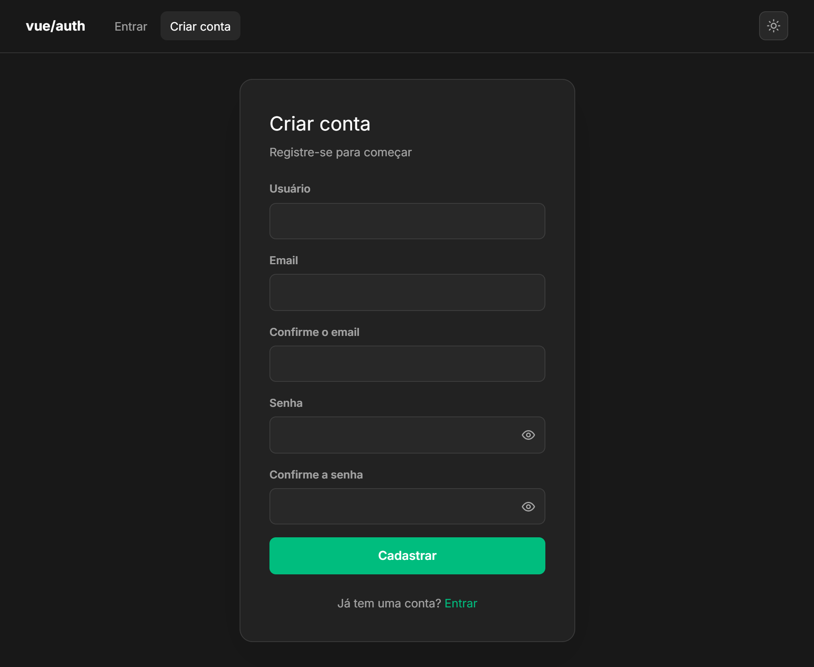
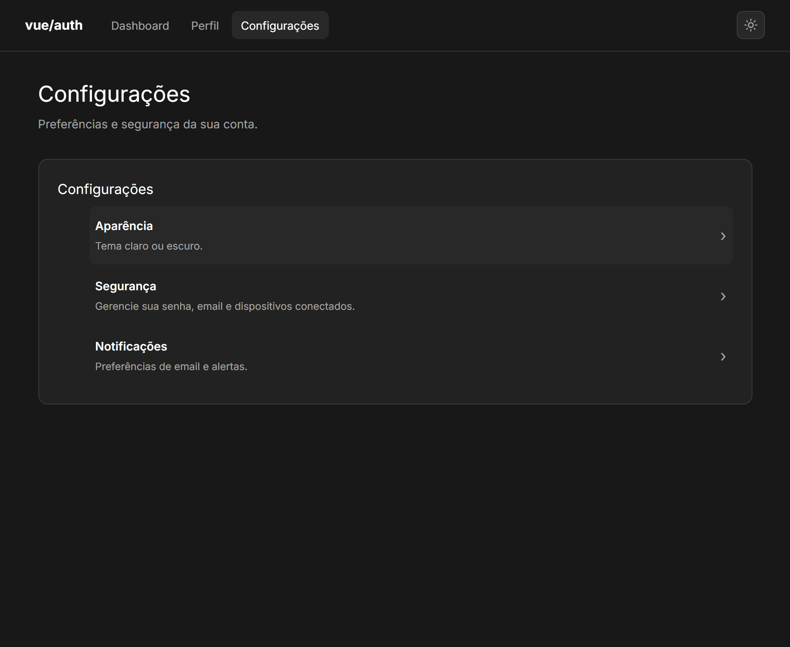
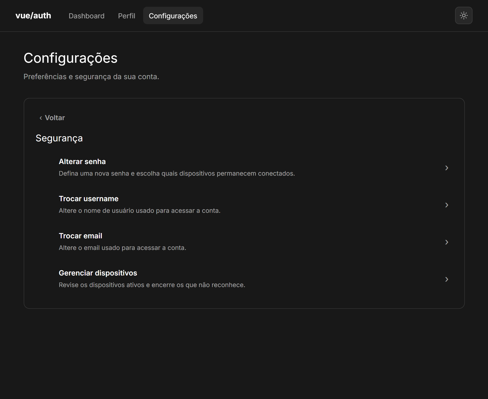

# login-frontend

Frontend de autenticação em Vue 3 + Vite + TypeScript (Pinia, vue-router, Vitest, Playwright).

Autenticação por **cookie httpOnly** (SameSite=Lax) definido pelo backend — nenhum token exposto ao JavaScript (proteção contra XSS).

## Imagens

### Login


### Cadastro


### Configurações


### Segurança


## Stack

- Vue 3 (`<script setup>`) + TypeScript
- Vite + vue-tsc
- Pinia (estado de sessão) + vue-router (rotas protegidas)
- Vitest (unit) + Playwright (e2e)
- oxlint / ESLint / oxfmt

## Documentação

| Documento | Descrição |
|---|---|
| [Autenticação](docs/authentication.md) | Fluxo de login, sessão JWT (cookie httpOnly), 4 mecanismos de expiração, tratamento de 401, logout |
| [Arquitetura](docs/architecture.md) | Visão geral do sistema, componentes de infraestrutura, stack de deploy |
| [Deploy](docs/deploy.md) | Docker Compose, blue-green, .env, comandos, Cloudflare Tunnel, port-forward |

## Configuração

```sh
bun install
bun dev            # Vite, proxy /api → http://localhost:8000
bun run build
bun test:unit
bun run lint
```

`VITE_API_BASE_URL` (`.env`) define a base da API; padrão `/api/v1`. Em dev, o proxy do Vite redireciona `/api` para `http://localhost:8000`.

## Scripts

| Script | Descrição |
| --- | --- |
| `bun dev` | Servidor de desenvolvimento (proxy `/api` → `:8000`) |
| `bun run build` | type-check + build de produção para `dist/` |
| `bun test:unit` | Testes unitários (Vitest) |
| `bun test:e2e` | Testes e2e (Playwright) |
| `bun run lint` | oxlint + eslint |
| `bun run format` | oxfmt sobre `src/` |
