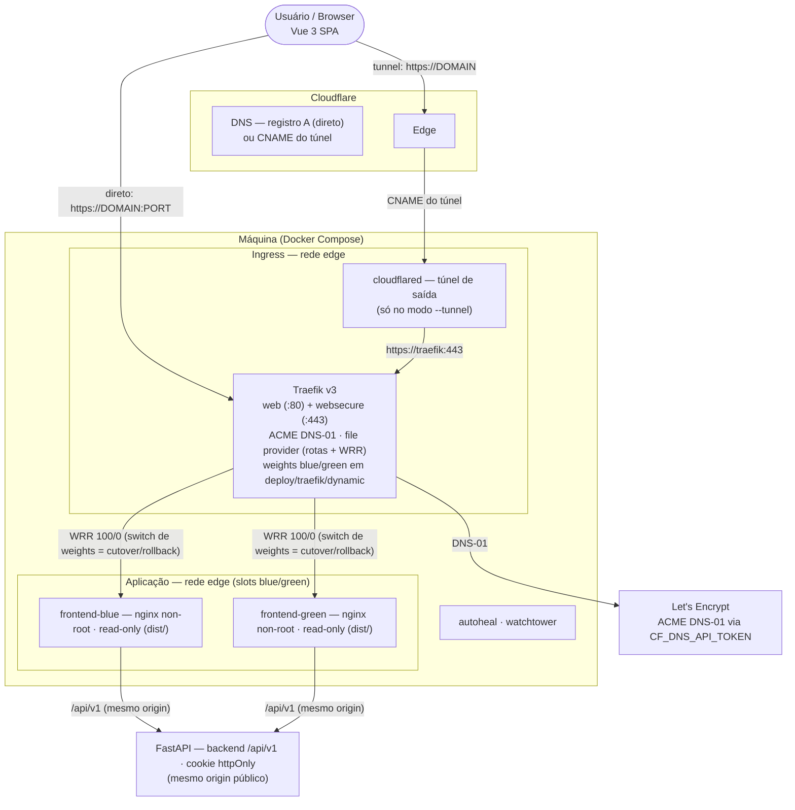

# Arquitetura do Sistema

Visão geral da infraestrutura e fluxo de dados do login-frontend.

## Visão geral

A aplicação é um SPA Vue 3 servido por nginx (container não-root, read-only) em **dois slots blue/green**, atrás do **traefik** (TLS + ACME DNS-01 via Cloudflare, com switch de tráfego por weights sem downtime). O frontend e o backend **FastAPI** compartilham o mesmo origin público (`/api/v1`), então o cookie httpOnly flui sem CORS. A máquina tem duas maneiras de expor o serviço: **modo direto** (port-forward no roteador) ou **Cloudflare Tunnel** (conexão de saída do `cloudflared`, sem abrir portas).

Para detalhes de deploy, veja [Deploy (Docker / HTTPS)](deploy.md). Para detalhes de autenticação, veja [Autenticação](authentication.md).

## Diagrama de componentes

## Stack de infraestrutura

| Camada | Componente | Função |
|---|---|---|
| DNS | Cloudflare | Registro A (direto) ou CNAME (túnel) |
| TLS | Let's Encrypt + ACME DNS-01 | Certificado automático via API Cloudflare |
| Ingress | Traefik v3 | Proxy reverso, TLS termination, WRR blue/green |
| Tunnel | cloudflared | Túnel de saída (modo tunnel, sem port-forward) |
| Frontend | nginx (non-root, read-only) | Serve o SPA estático (dist/) |
| Backend | FastAPI | API /api/v1, gerencia cookie HttpOnly |
| Ops | autoheal + watchtower | Healthcheck e auto-update de infra |
