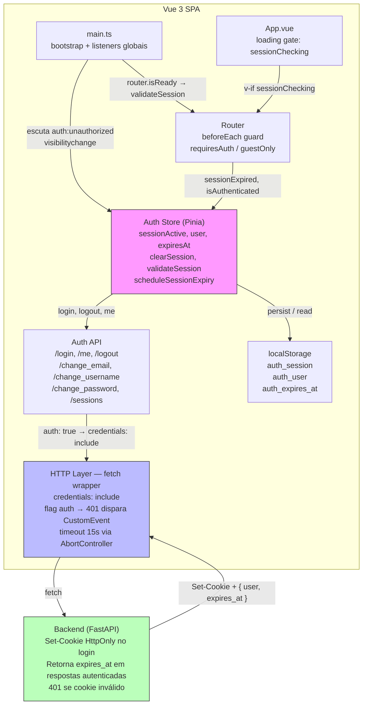
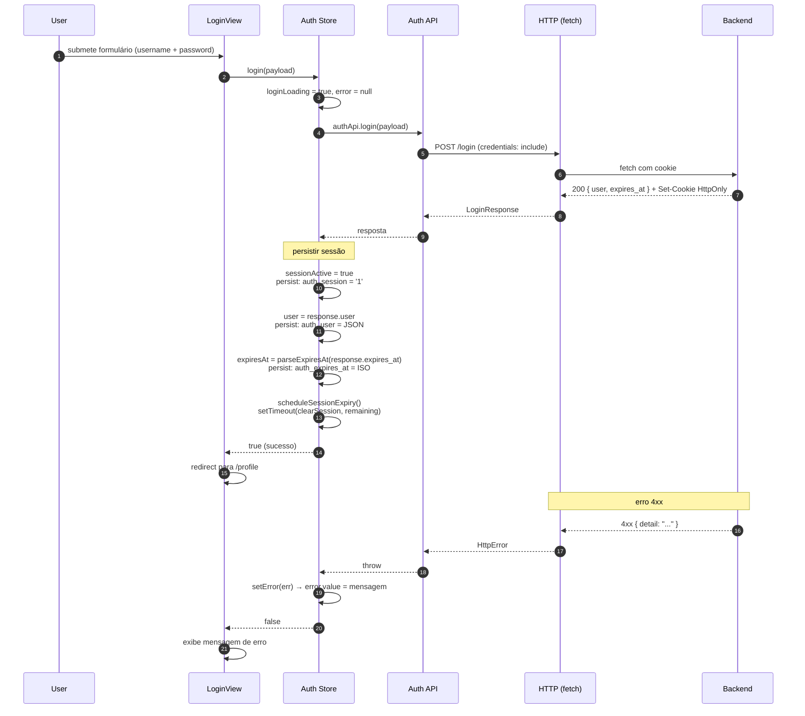
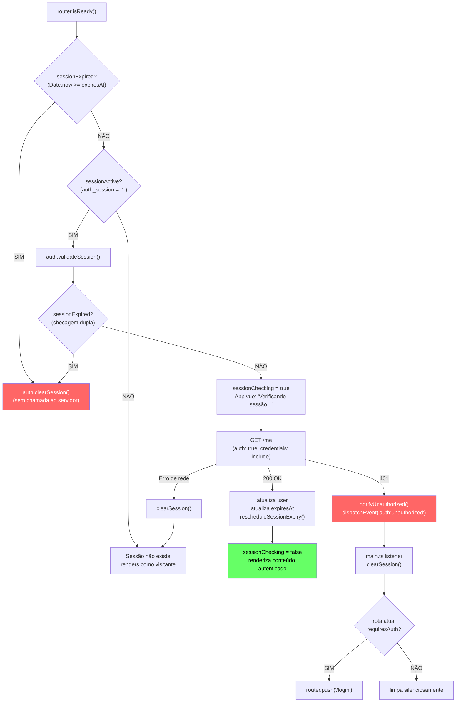
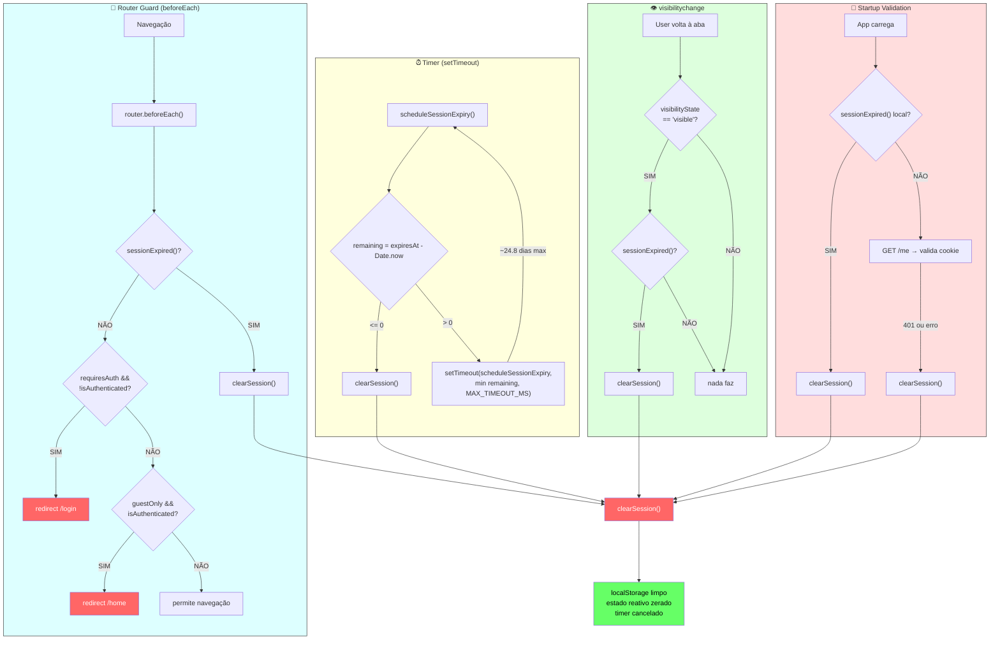
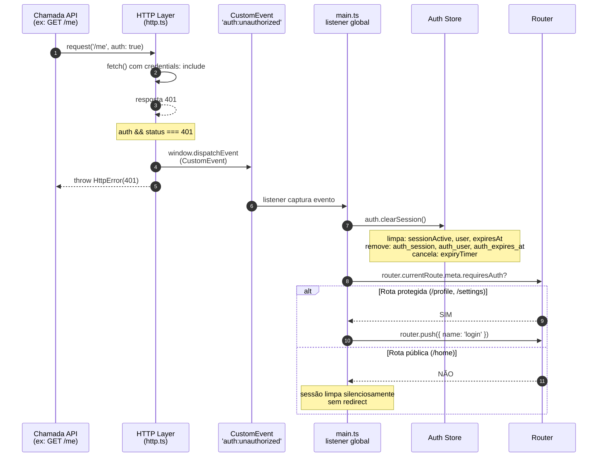
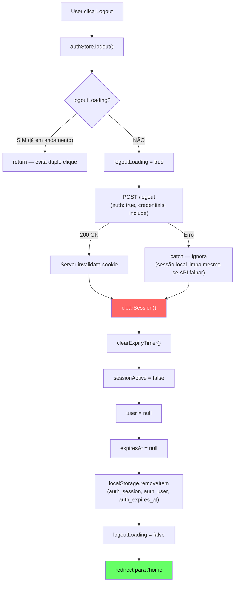

# Autenticação

Fluxo completo de autenticação no frontend — cookie httpOnly, gerenciamento de sessão e expiração.

> **Princípio:** o token JWT nunca expõe ao JavaScript. Ele vive em um cookie HttpOnly (SameSite=Lax) setado pelo backend. No frontend, o store gerencia apenas **metadados de sessão** no localStorage: flag de sessão, dados do usuário e timestamp de expiração.

## Armazenamento

| Chave localStorage | Tipo | Conteúdo |
|---|---|---|
| `auth_session` | `'1'` | Flag indicando sessão ativa |
| `auth_user` | JSON | Objeto `UserInfo` (`{ username?, email? }`) |
| `auth_expires_at` | ISO-8601 | Timestamp de expiração retornado pelo servidor |

O cookie HttpOnly é enviado automaticamente em todas as requisições via `credentials: 'include'`.

## Visão geral dos componentes



## Fluxo de login



## Validação de sessão no startup

Ao carregar a app, o `main.ts` verifica se a sessão local ainda é válida e, se sim, valida com o servidor.



## Os 4 mecanismos de expiração

A sessão pode expirar por 4 caminhos independentes. Todos convergem para `clearSession()`.

### Visão geral



### Detalhes de cada mecanismo

#### A — Timer (`setTimeout` recursivo)

**Arquivo:** `src/stores/auth.ts:108-123`

```
scheduleSessionExpiry()
  → clearTimeout(expiryTimer)
  → remaining = expiresAt - Date.now()
  → remaining <= 0?
      SIM → clearSession()
      NÃO → setTimeout(scheduleSessionExpiry, min(remaining, 2_147_000_000))
```

- `MAX_TIMEOUT_MS = 2_147_000_000` (~24.8 dias) — evita overflow de 32 bits do `setTimeout`
- Timer é recursivo: quando dispara, reagenda se ainda houver tempo, ou chama `clearSession()`
- Agendado em: `login()`, `validateSession()`, `changeEmail()`, `changeUsername()`
- Cancelado por: `clearExpiryTimer()` chamado dentro de `clearSession()`

#### B — Router Guard (`beforeEach`)

**Arquivo:** `src/router/index.ts:57-68`

- Roda a **cada navegação** antes da resolução da rota
- Checa `sessionExpired()` (comparação `Date.now() >= expiresAt`)
- Se expirou → `clearSession()` silenciosamente
- depois aplica regras de acesso:
  - `requiresAuth` + não autenticado → `/login`
  - `guestOnly` + autenticado → `/home`

#### C — `visibilitychange`

**Arquivo:** `src/main.ts:39-43`

- Dispara quando o usuário **volta para a aba** do browser
- Verifica `sessionExpired()` — se o timer foi throttled pelo browser (aba em background), este mecanismo pega

#### D — Startup Validation

**Arquivo:** `src/main.ts:31-37` + `src/stores/auth.ts:268-291`

- Roda uma única vez no carregamento da app
- Se a sessão local expirou → `clearSession()` sem chamada ao servidor
- Se não expirou → `GET /me` para validar o cookie com o servidor
- Sucesso → atualiza `user` + `expiresAt` + reschedule timer
- 401/erro → `clearSession()`

## Tratamento de 401 (Unauthorized)

Quando uma chamada API com `auth: true` retorna 401, o HTTP layer dispara um CustomEvent que é capturado globalmente.



### Endpoints com `auth: true` (disparam evento em 401)

| Endpoint | Método | Descrição |
|---|---|---|
| `/me` | GET | Valida sessão, retorna user + expires_at |
| `/logout` | POST | Invalida cookie no servidor |
| `/change_password` | PATCH | Altera senha |
| `/change_email` | PATCH | Altera email (renova expires_at) |
| `/change_username` | PATCH | Altera username (renova expires_at) |
| `/sessions` | GET | Lista sessões ativas |
| `/sessions/:id` | DELETE | Encerra uma sessão específica |

### Endpoints sem `auth: true` (401 tratado normalmente)

| Endpoint | Método |
|---|---|
| `/login` | POST |
| `/register` | POST |
| `/forgot_password` | POST |

## Logout



## Renovação de sessão

Não existe refresh token. O servidor pode **renovar** a sessão retornando um novo `expires_at` em chamadas autenticadas. O frontend sempre picks up o valor mais recente:

- `GET /me` (startup validation)
- `PATCH /change_email`
- `PATCH /change_username`

Quando `response.expires_at` está presente, o store:
1. Atualiza `expiresAt.value`
2. Persiste no localStorage
3. Reschedule o timer `scheduleSessionExpiry()`

## Referência de componentes

| Componente | Arquivo | Responsabilidade |
|---|---|---|
| Auth Store | `src/stores/auth.ts` | Estado reativo, login/logout, timer, clearSession, validateSession |
| HTTP Layer | `src/services/http.ts` | fetch wrapper com `credentials: 'include'`, flag `auth`, CustomEvent em 401, timeout 15s |
| Auth API | `src/services/authApi.ts` | Chamadas tipadas para endpoints de autenticação |
| Router Guard | `src/router/index.ts` | `beforeEach`, regras `requiresAuth` / `guestOnly` |
| Startup | `src/main.ts:31-37` | `validateSession()` no boot da app |
| visibilitychange | `src/main.ts:39-43` | Re-verifica expiração ao voltar à aba |
| Unauthorized | `src/main.ts:22-27` | Escuta `auth:unauthorized`, limpa sessão + redirect |
| Config | `src/config/api.ts` | Chaves do localStorage, base URL da API |
| Types | `src/types/auth.ts` | `LoginResponse`, `UserInfo`, `SessionInfo`, payloads |
